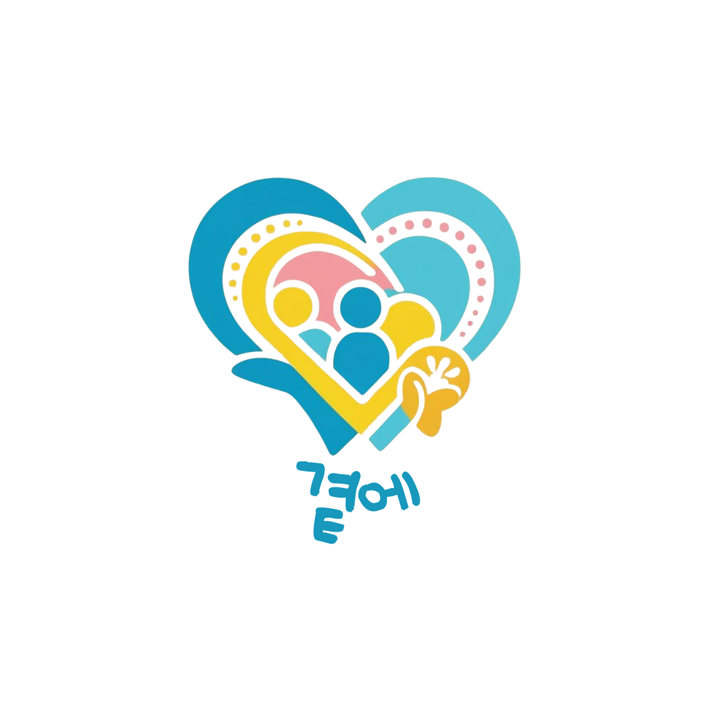
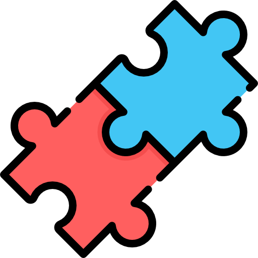
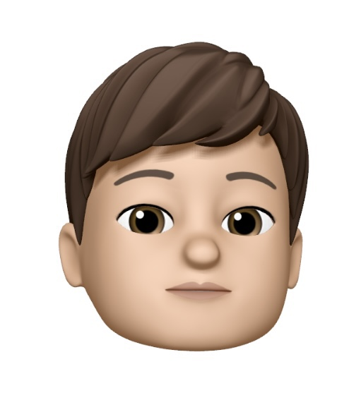
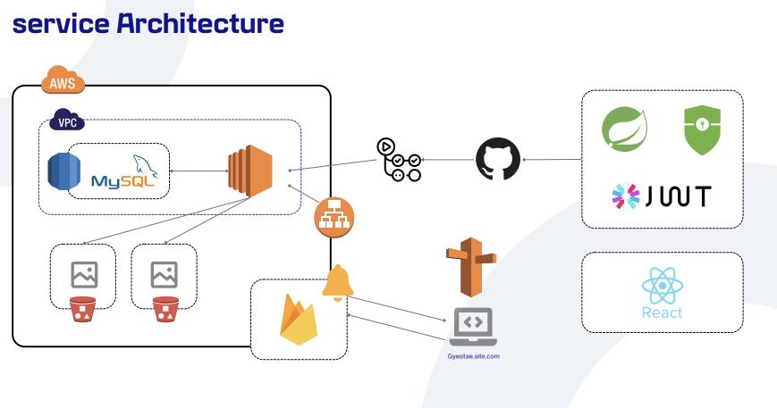
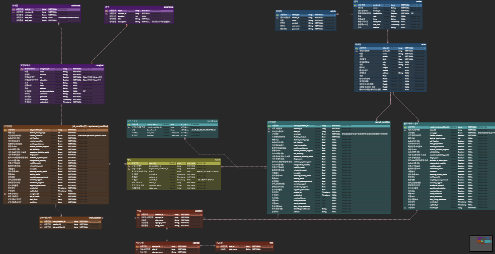

# Dancy - 춤 연습 보조 SNS 서비스

<div align="center">
  <br />
  
  <br />
</div>

## 목차

- [서비스 개요](#서비스-개요)
- [팀원소개](#팀원소개)
- [기술스택](#기술스택)
- [시스템 아키텍처](#시스템-아키텍처)
- [기능소개](#기능소개)
- [프로젝트 산출물](#프로젝트-산출물)

## 서비스 개요

```
'재가노인복지센터의 사회복지사를 위한'
요양보호사와 노인의 최적 매칭을 통해 재가노인복지센터의 구인난을 해결하고
맞춤형 돌봄 서비스를 제공하는 매칭 플랫폼 
```

## 팀원소개

<div align="middle">
<table>
    <tr>
        <td height="140px" align="center"> <a href="https://github.com/dalcheonroadhead">
             <br><br> 🎨 전수민 <br>(PM) </a> <br></td>
        <td height="140px" align="center"> <a href="https://github.com/GEISHAz">
             <br><br> 👑 정민호 <br>(Back-End) </a> <br></td>
        <td height="140px" align="center"> <a href="https://github.com/connorcoco">
             <br><br> 🎮 박성현 <br>(Back-End) </a> <br></td>
        <td height="140px" align="center"> <a href="https://github.com/Hszoo">
             <br><br> 🐰 홍성주 <br>(Back-End) </a> <br></td>
        <td height="140px" align="center"> <a href="https://github.com/ByeongJo-Park">
             <br><br> ⚽ 박병조 <br>(Front-End) </a> <br></td>
        <td height="140px" align="center"> <a href="https://github.com/Anjihee">
             <br><br> 💎 안지희 <br>(Front-End) </a> <br></td>
        <td height="140px" align="center"> <a href="https://github.com/Jsub22">
             <br><br> 🥨 정수빈 <br>(Front-End) </a> <br></td>
    </tr>
</table>
</div>

## 기술스택

### 프론트엔드

<div align="middle">


**Language |** Typescript (Node: )

**Framework |** React (version: )

**Library |** Axios (1.6.7), Styled Components (6.1.8), Recoil (0.7.7), Yarn (1.22.21), EventSourcePolyfill (1.0.31)

<br>
<br>

</div>

### 백엔드

<div align="middle">

 


">

**Language |** Java 17

**Framework |** Spring Boot 3.3.6

**Data(RDBMS) |** Spring Data JPA

**Build Tool |** Gradle 8.5.0

</div>

<br>
<br>

### 인프라

<div align="middle">


**DB |** MySQL 8.0

**Server |** Github, Nginx

</div>

<br>
<br>

## 시스템 아키텍처

<div align="middle">
  <br />
  
  <br />
</div>

<br>
<br>

## 기능소개

🧡 메인 페이지


- 메인페이지에서 요양보호사 및 관리자로 회원가입 및 로그인이 가능합니다.

<br>
<br>

💛 요양보호사 메인 페이지


- 요양보호사는 메인페이지에서 근무요청을 확인할 수 있습니다.
- 요양보호사는 메인페이지에서 근무상태를 변경 및 정보 수정 및 일정확인이 가능합니다.

<br>
<br>

💚 관리자 메인 및 대시보드 페이지


- 관리자는 메인페이지를 통해 센터의 매칭상황 및 통계를 확인할 수 있습니다.
- 어르신 등록 및 구인조건 등록또한 가능합니다.
  <br>
  <br>

💙 구직 및 구인 등록 페이지


- 요양보호사는 구직조건을 작성함으로써 원하는 근무환경을 적을 수 있습니다.
- 관리자는 어르신별 구인조건을 작성함으로써 필요한 근무환경을 세팅할 수 있습니다.
  <br>
  <br>

🤎 요양보호사 추천 페이지


- 요양보호사의 구직 조건과 관리자의 구인조건을 비교하여 요양보호사를 추천합니다.
- 시간, 장소, 근무조건등을 비교하여 최적의 매칭추천을 제공합니다.

<br>
<br>

💜 근무 요청 페이지


- 추천된 요양보호사에 대하여 근무요청을 보낼 수 있습니다.
  <br>
  <br>

🖤 근무 요청 응답페이지


- 요청받은 근무요청에 대해 수락/조율/거절 응답을 보낼 수 있습니다.
  <br>
  <br>

## 프로젝트 산출물

- API 명세서

> https://solar-spot-733.notion.site/API-3afd7f311614419384622eda0cd66e6a?pvs=73

<br>
<br>

- ERD
<div align="middle">
  <br />
  
  <br />
</div>
<br>
<br>

<br>
<br>

- Git 컨벤션
  <br>


<br>
